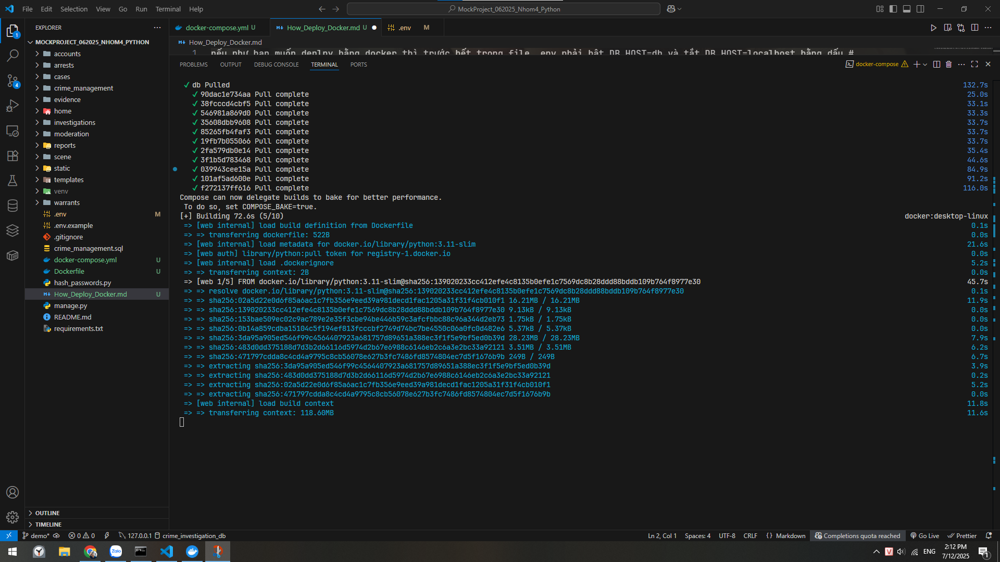
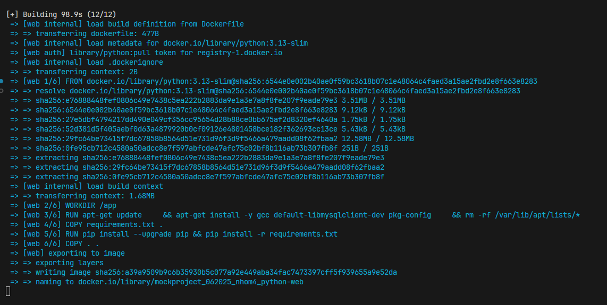
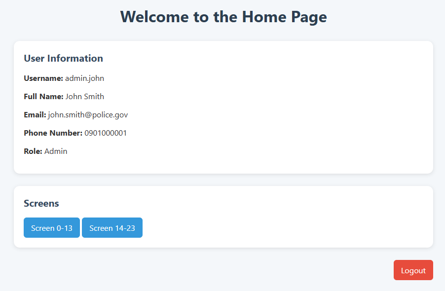
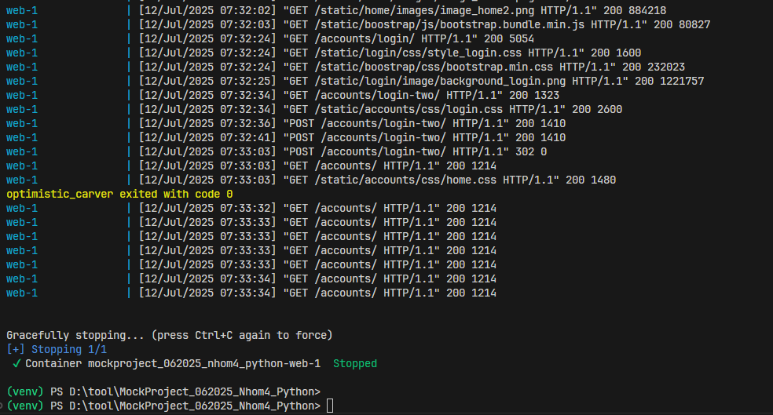

## 📦 Hướng dẫn deploy bằng Docker (chỉ Django, không dùng MySQL trong Docker)

---

### ⚙️ Cấu hình `.env`

Nếu như bạn muốn deploy bằng Docker thì trước hết trong file `.env` phải:

* **Bật** dòng:

  ```env
  DB_HOST=db
  ```

* **Tắt** dòng:

  ```env
  #DB_HOST=localhost
  ```

---

### 🗃️ Nhập dữ liệu

Sau đó đọc file và nhập dữ liệu SQL như trong `crime_management.sql` (xem hướng dẫn trong `README.md` gốc nếu có).

---

### 🚀 Deploy Django bằng Docker

Sau khi hoàn tất cấu hình và nhập dữ liệu:

```bash
docker-compose up --build
```

---

### ✅ Sau khi deploy

Bạn có thể truy cập ứng dụng để kiểm tra và test như bình thường.

---

### 📸 Một số ảnh minh họa:

| STT | Hình ảnh                      |
| --- | ----------------------------- |
| 1   |     |
| 2   |     |
| 3   |   |
| 4   |    |
| 5   |  |